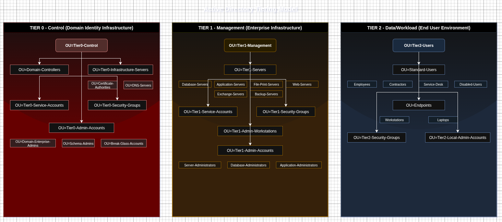

## Archtecture Diagram

  
   
  <em>Active Directory Tiering Model - Security Architecture</em>

# Tiering Model - On Premise Active Directory

## Tier 0 (Control) - Domain Identity Infrastructure

Root:OU=Tier0-Control,DC=domain,DC=com
<pre>
📁 Tier0-Control/
├── 📁 Domain-Controllers/
├── 📁 Tier0-Infrastructure-Servers/
│   ├── 📁 Certificate-Authorities/
│   └── 📁 DNS-Servers/
├── 📁 Tier0-Service-Accounts/
├── 📁 Tier0-Security-Groups/
└── 📁 Tier0-Admin-Accounts/
    ├── 📁 Domain-Enterprise-Admins/
    ├── 📁 Schema-Admins/
    └── 📁 Break-Glass-Accounts/
</pre>

## Tier 1 (Management) - Enterprise Infrastructure

Root: OU=Tier1-Management,DC=domain,DC=com
<pre>
📁 Tier1-Management/
├── 📁 Tier1-Servers/
│   ├── 📁 Database-Servers/
│   ├── 📁 Application-Servers/
│   ├── 📁 File-Print-Servers/
│   ├── 📁 Web-Servers/
│   ├── 📁 Exchange-Servers/
│   └── 📁 Backup-Servers/
├── 📁 Tier1-Service-Accounts/
├── 📁 Tier1-Security-Groups/
├── 📁 Tier1-Admin-Workstations/
└── 📁 Tier1-Admin-Accounts/
    ├── 📁 Server-Administrators/
    ├── 📁 Database-Administrators/
    └── 📁 Application-Administrators/
</pre>

## Tier 2 (Data/Workload) - End User Environment

Root: OU=Tier2-Users,DC=domain,DC=com
<pre>
📁 Tier2-Users/
├── 📁 Standard-Users/
│   ├── 📁 Employees/
│   ├── 📁 Contractors/
│   ├── 📁 Service-Desk/
│   └── 📁 Disabled-Users/
├── 📁 Endpoints/
│   ├── 📁 Workstations/
│   └── 📁 Laptops/
├── 📁 Tier2-Security-Groups/
└── 📁 Tier2-Local-Admin-Accounts/
</pre>

## Structure Management & Practices

1.Enhanced Security Isolation
Separate OUs for users and computers to enable precise Group Policy application and delegation.
https://www.manageengine.com/products/active-directory-audit/kb/best-practices/active-directory-ou-best-practices.html
https://www.tenfold-security.com/en/organizational-unit/

2.The most important tip is to group user and computer objects into separate organizational units.         
https://www.cayosoft.com/active-directory-best-practices/

3.Service Account Segregation
Dedicated service account OUs at each tier to prevent credential theft through service account compromise.

4.Emergency Access
Break-glass accounts for emergency access when normal authentication fails.         
https://www.cayosoft.com/active-directory-ou/

# Implementation Best Practices:

## Naming Convention
- Use descriptive, consistent naming: "OU=Tier0-Domain-Controllers"
- Include tier level for easy identification
- Use hyphens for readability

## Group Policy Strategy
Link GPOs to OUs rather than containers, use inheritance for efficient policy management.         
https://www.tenfold-security.com/en/organizational-unit/
https://activedirectorypro.com/active-directory-management-tips/

## Administrative Delegation
Delegate permissions to security groups rather than individual accounts for easier management.         
https://learn.microsoft.com/en-us/windows-server/identity/ad-ds/plan/reviewing-ou-design-concepts

## Protection Settings
Enable "Protect object from accidental deletion" on all critical OUs.                           
https://learn.microsoft.com/en-us/windows-server/identity/ad-ds/plan/reviewing-ou-design-concepts

## Security Enhancements for Windows Server 2025:
New Windows Server 2025 features include delegated Managed Service Accounts (dMSA), improved Kerberos settings, and enhanced LAPS integration.
https://techcommunity.microsoft.com/blog/microsoft-security-baselines/windows-server-2025-security-baseline/4358733

## Additional Considerations:

- LAPS Implementation: Deploy Local Administrator Password Solution across all computer OUs.
- Authentication Policies: Implement Kerberos authentication policies for Tier 0 protection.
- Audit Policies: Enhanced auditing for privileged account activities.
- Time-bound Access: Consider implementing Just-In-Time (JIT) access for administrative accounts.
